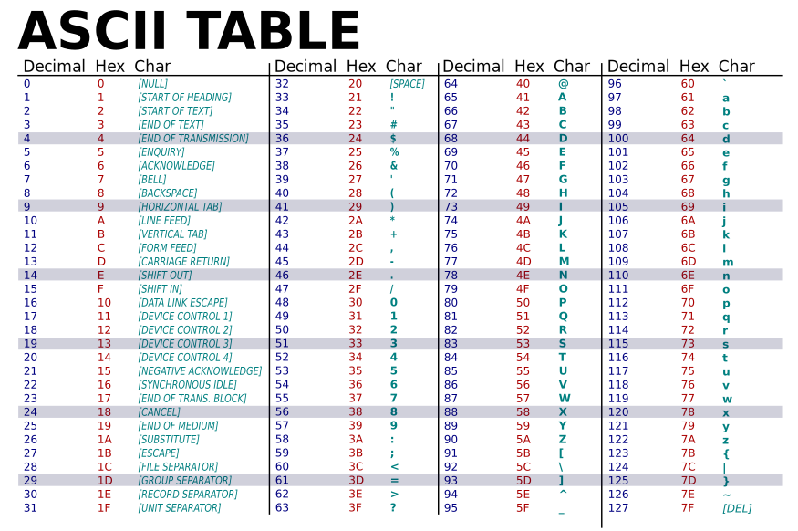
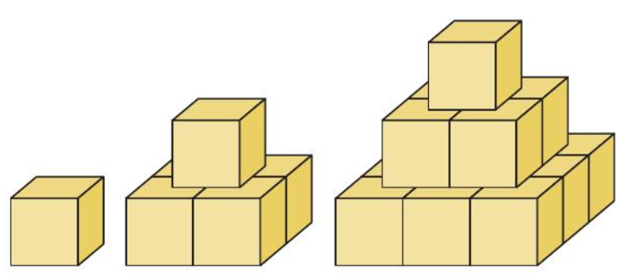

# 01 - Algorithmique

## MxSTI 1.1

Dans chaque cas un booléen est renvoyé. Lequel ?

+ `2 > 4`
+ `3 != 4`
+ `2 < 5 && 5 >= 3`
+ `2 < 5 || 4 < 0`
+ `! (2 < 3 || 1 > 2)`

## MxSTI 1.2

Qu'affiche le programme suivant si on saisit `Sacha` à la ligne 7 ?

```c linenums="1"
#include <stdio.h>

int main() {
    
    char a, b, c, d, e, f, g, h = 0;

    scanf("%c%c%c%c%c", &a, &b, &c, &d, &e);

    f = c - '1' + '\n' * 3;

    g = ++d + 0xA - sizeof(1234567890) * 2;
    
    h = d - !(b == e && h);

    printf("%c%c%c%xc%c%c", f, d, g, 's' - d, h, a + 34);

    return 0;
}
```

??? tip "A toutes fins utiles"

	

## MxSTI 1.3

On exécute l’algorithme suivant en saisissant `N = 2`

```
VARIABLES :
	N est un entier
	U, V, W sont des réels
	K est un entier
DEBUT :
	Affecter 0 à K
	Affecter 2 à U
	Affecter 10 à V
	Saisir N
	Tant que K < N
		Affecter K + 1 à K
		Affecter U à W
		Affecter (2 * U + V) / 3 à U
		Affecter (W + 3 * V) / 4 à V
	Fin tant que
	Afficher U
	Afficher V
FIN
```

Donner l’état des variables au cours de l’exécution de l’algorithme.

Traduire en C et vérifier les résultats trouvés.

??? question "Tu ne sais pas traduire le "tant que..." ?"

	[Documentation en ligne :material-play:](https://openclassrooms.com/fr/courses/19980-apprenez-a-programmer-en-c/14722-repetez-des-instructions-grace-aux-boucles#/id/r-14682){ .md-button .md-button--primary }

## MxSTI 1.4

On souhaite écrire une séquence d’instructions qui calcule :

$$
\frac{1}{1}\times\frac{1}{3}...\times\frac{1}{2k+1}\times...\times\frac{1}{51}
$$

Un élève propose le programme suivant, mais rien ne s’affiche dans la console.

```c
#include <stdio.h>

int main() {
	float p = 1;
	int k = 0;
	while (2 * k + 1 <= 51) {
		p = p * 1 / (2 * k + 1);
	}
	printf("%f", p);
} 
```

1. Expliquer ce qu’il se passe et rectifier le programme.
2. Proposer un autre programme qui effectue la même tâche avec une boucle bornée (boucle `for`).

## MxSTI 1.5

On cherche à déterminer les solutions strictement positives de l’équation :

$$
e^x+e^{-x}-4x-2=0
$$

### Question 1

On note $f$ la fonction définie sur l’intervalle $[0,+\infty[$ par : 

pour tout $x>0$, $f(x)=e^x+e^{-x}-4x-2$

**Vérifier** que pour tout $x>0$,

$$
f(x)=x(\frac{e^x}{x}-4)+e^{-x}-2
$$

En **déduire** 

$$
\lim_{x \to +\infty}f(x)
$$

### Question 2

On admet que le tableau de signe de $f'$ est le suivant :

| $x$ | $0$ | | $ln(2+\sqrt{5})$ | | $+\infty$ |
| :---: | :---: | :---: | :---: | :---: | :---: |
| $f’(x)$ | | $-$ | $0$ | $+$ | |

Dresser le tableau de variations de la fonction $f$ et démontrer que l’équation $f(x)= 0$ admet une unique solution strictement positive $\alpha$.

### Question 3

On considère l’algorithme de dichotomie suivant :

```
VARIABLES :
	a, b et ù sont des nombres réels

INITIALISATION :
Affecter à a la valeur 2
Affecter à b la valeur 3

TRAITEMENT :
Tant que b - a > 0,1
	Affecter à m la valeur (a + b) / 2
	Si f(m) > 0 alors
		Affecter à b la valeur de m
	Sinon
		Affecter à a la valeur de m
	Fin Si
Fin Tant que
Afficher a et b
```

1. Exécuter cet algorithme en notant dans un tableau, les valeurs de `a`, `b`, `b-a` et `m`.
2. Que représentent les valeurs affichées par cet algorithme ?
3. Ecrire en C une fonction qui met en œuvre l’algorithme précédent. Documenter cette fonction.
4. Modifier cette fonction pour qu’elle renvoie une valeur de $\alpha$ à $10^{-3}$ près.

## MxSTI 1.6

Avec des cubes identiques, on construit des pyramides comme indiqué ci-dessous :



1. Combien de cubes sont nécessaires pour construire une pyramide à 4 étages ? A 5 étages ?

2. Proposer une fonction « pyramide » en C qui permet, pour un entier N donné, de renvoyer le nombre de cubes nécessaires pour construire une pyramide à N étages.

3. Faire fonctionner le programme pour qu’il renvoie le nombre de cubes nécessaires pour construire une pyramide à 20 étages, puis 30 étages.

4. On dispose de 5 000 cubes. On voudrait savoir quel est le nombre maximal d’étages que l’on peut construire. Proposer un programme en C qui, pour un entier K donné, renvoie le nombre maximal d’étages que l’on peut construire avec K cubes, ainsi que le nombre de cubes non utilisés.