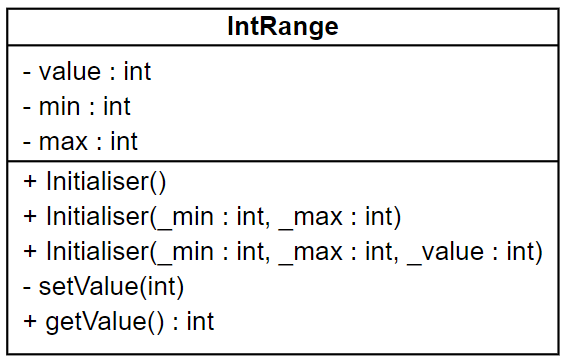
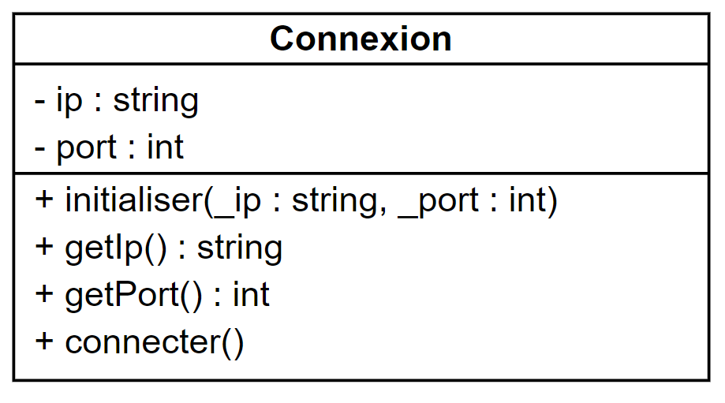
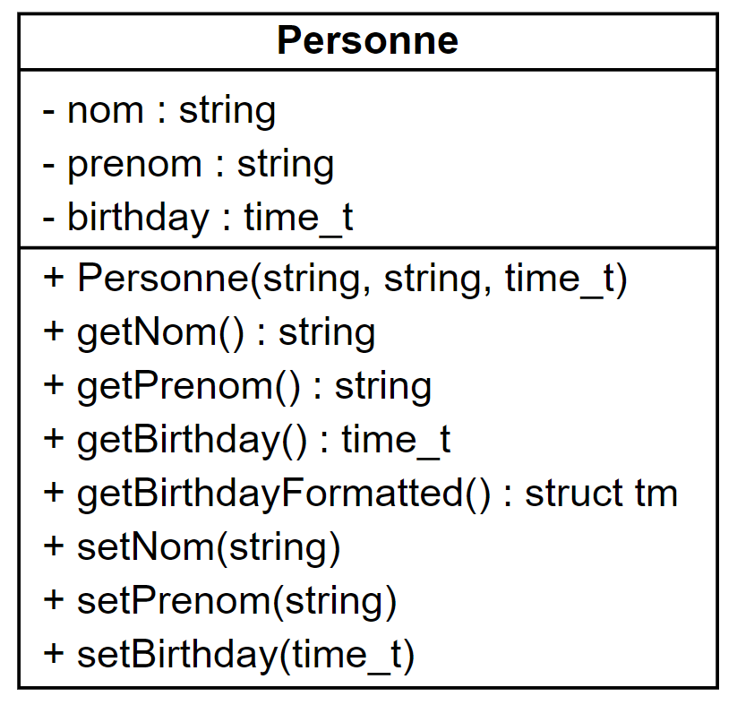

# 02 - Premiers pas en POO

## Cours

<object data="../../pdf/cours/bts2/bts2_02_introduction-a-la-poo.pdf" type="application/pdf">
    <embed src="../../pdf/cours/bts2/bts2_02_introduction-a-la-poo.pdf" type="application/pdf" />
</object>

## Exercice 1

Déclarer en C++ la classe correspondant au diagramme suivant :


    
??? success "Correction"

    ```cpp
    // Fichier IntRange.hpp

    #ifndef IntRange_H
    #define IntRange_H
    class IntRange {
        private :
            int value;
            int min;
            int max;
        public :
            void initialiser();
            void initialiser(int _min, int _max);
            void initialiser(int _min, int _max, int _value);
            int getValue();
        private :
            void setValue(int);
    };
    #endif
    ```


## Exercice 2

Compléter la classe C++ suivante :

```cpp
______ DataBase {
    _______ :
        string server;
        int port;
        string login;
        ______ password;
        string name;
    public :
        void init(string _server, int _port, string _login, string _password);
        string getIp();
        ______ getPort();
        string getLogin();
        string getName();
        void setName(______ _name);
        string getConnectionString();
        bool connect();
        bool check();
};

```

Définir en C++ à l’extérieur de la classe les méthodes `getName()` et `setName()`.

??? success "Correction"

    ```cpp
    // Fichier DataBase.hpp

    #ifndef DataBase_H
    #define DataBase_H

    #include <string>

    using namespace std;

    class DataBase {
        private :
            string server;
            int port;
            string login;
            string password;
            string name;
        public :
            void init(string _server, int _port, string _login, string _password);
            string getIp();
            int getPort();
            string getLogin();
            string getName();
            void setName(string _name);
            string getConnectionString();
            bool connect();
            bool check();
    };

    #endif
    ```

    ```cpp
    // Fichier DataBase.cpp

    #include "DataBase.hpp"

    string DataBase::getName() {
        return name;
    }

    void DataBase::setName(string _name) {
        name = _name;
    }
    ```

## Exercice 3

Dessiner le diagramme correspondant à la classe C++ suivante dans [Visual Paradigm](https://online.visual-paradigm.com/login.jsp){:target="_blank"} :

```cpp
class Connexion {
    private :
        string ip;
        int port;
    public :
        void initialiser(string _ip, string port);
        string getIp();
        int getPort();
        void connecter();
}
```

??? success "Correction"

    

## Exercice 4

Corriger dans [Visual Paradigm](https://online.visual-paradigm.com/login.jsp){:target="_blank"} la classe suivante pour qu'elle respecte l'encapsulation :


??? success "Correction"

    

    La date d'anniversaire n'étant pas une donnée qui peut être modifiée, on pourra discuter de l'utilité du mutateur de birthday.

## Exercice 5

On souhaite générer une classe représentant un compteur. Celui-ci est composé d'une valeur entière positive ou nulle, nulle à l'origine. Il ne peut varier que par pas de 1 (incrémentation ou décrémentation). Décrémenter un compteur nul est sans effet.

1. Commencer par un diagramme de classe

2. Ecrire la classe Counter dans deux fichiers, un pour la déclaration (Counter.hpp) et un pour la définition (Counter.cpp)

3. Ecrire un programme de test (exo5.cpp)

??? note "Compiler plusieurs fichiers"

    Créer les fichiers dans un même répertoire, puis les compiler avec la commande : 

    ```
    > g++ *.cpp -o exo_5.exe
    ```

??? success "Correction"

    

## Exercice 6

On veut écrire une classe Television comprenant les données membres suivantes :

- status ("On"/"Off")
- volume (0 <-> 50)
    - Le volume ne peut pas aller au-delà des limites.
- channel (1 <-> 100)
    - Les chaînes bouclent.

Le but est d’encapsuler dans une classe des méthodes permettant de manipuler un objet `Television`.

A la création, l’objet `Television` est éteint avec le volume à 0 et sur la chaîne 1.

1. Définir les méthodes que vous devez implémenter dans votre classe (mettez vous en situation d’utilisateur de la classe, les méthodes doivent être pratiques et avoir un nom explicite).

2. Représenter la classe en UML.

3. Ecrire le code de ces méthodes. La déclaration et la définition de la classe (fonctions membres) seront dans des fichiers séparés (Television.h et Television.cpp).

## Exercice 7

Ecrire une classe Fraction :

- Cette classe contient un numérateur et un dénominateur dont les valeurs par défaut sont égale à 1.

- On pourra instancier un objet Fraction en spécifiant numérateur et dénominateur ou en ne spécifiant que le numérateur.

- On pourra afficher la Fraction sous la forme numérateur/dénominateur.

- On mettra en place les accesseurs nécessaires.

- On pourra additionner deux objets Fraction et obtenir le résultat sous la forme d'un troisième objet Fraction.

Votre mission :

1. Représenter la classe en UML.

2. Ecrire le code de la classe dans des fichiers séparés et un programme de démonstration.

