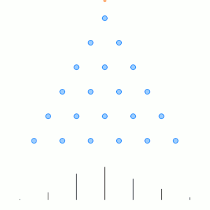
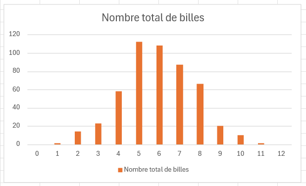

# 01 - Planche de Galton

{ align=right }

Un joueur lâche une bille sur une planche inclinée sur laquelle sont plantés des clous comme sur la figure ci‑contre.

À chaque clou rencontré, la bille passe indifféremment à droite ou à gauche de façon équiprobable. 

En fin de parcours, elle tombe dans une case. 



Dans ce TP, on considère une planche de Galton à douze rangées de clous. 

Il y a donc 13 cases numérotées de 0 (case à gauche) à 12 (case à droite).

On suppose qu'à chaque clou, la probabilité d'aller à droite est égale à 0,5.

??? question "Qui est Galton ?"

    { align=left }
    
    Sir Francis Galton (1822 - 1911) est un anthropologue, explorateur, géographe, inventeur, météorologue, écrivain, proto-généticien, psychométricien et statisticien britannique.

## Objectifs

Simuler la chute de 1 000 billes le long de cette planche et vérifier que la simulation est bien cohérente avec la théorie.

## Questions préliminaires

1) En réalisant un schéma et en partant du principe que à chaque niveau quand la bille tombe à gauche son trajet vaut 0 et que quand elle part à droite son trajet vaut 1, trouver le lien entre le parcours de la bille et le numéro de la case dans laquelle elle va tomber. 

2) Estimer la probabilité que la bille tombe :

+ Dans la case de gauche

+ Dans la case n°6

## Simulation dans Excel 365

1) Reproduire à l'aide d'Excel 365 la feuille de calcul ci-dessous.


2) On commence par la bille n°1. Remplir les colonnes `B5` à `M5` aléatoirement de `0` et de `1`.

??? tip "Indice"

    Utiliser les fonctions Excel [`SI`](https://support.microsoft.com/fr-fr/office/si-si-fonction-69aed7c9-4e8a-4755-a9bc-aa8bbff73be2) et [`ALEA`](https://support.microsoft.com/fr-fr/office/alea-alea-fonction-4cbfa695-8869-4788-8d90-021ea9f5be73)

3) A partir du résultat de votre réflexion préléminaire, compléter la case `N5` avec une formule qui calcule la case d'arrivée de la bille.

??? question "Comment empêcher Excel de recalculer sans cesse les formules ?"

    

4) A l'aide de la poignée de recopie, simuler la chute de 1000 billes.

5) Utiliser la ligne 2 pour compter le nombre de billes dans chacune des cases d'arrivée.

??? tip "Indice"

    Utiliser les fonctions Excel [`NB.SI`](https://support.microsoft.com/fr-fr/office/fonction-nb-si-e0de10c6-f885-4e71-abb4-1f464816df34)

6) Créer le graphique ci-dessous à l'aide des données des lignes 1 et 2.



## Simuler à l'aide d'un programme en C++

Le programme à développer devra simuler le lâcher des billes sur la planche de Galton. 

Le nombre de lignes de la planche de Galton et le nombre de billes à lâcher doivent être renseignés sur la ligne de commande.

```
> ./galton.exe [nombre de lignes] [nombre de billes]
```

Après avoir simulé le lâcher des billes, le programme affichera le nombre de billes par cases (`bins`) ainsi que leur indice.

Affichage attendu :

```
> ./galton.exe 12 1000 
[    0 ][    2 ][   18 ][   40 ][  117 ][  191 ][  246 ][  203 ][  112 ][   55 ][   14 ][    1 ][    1 ]
    0       1       2       3       4       5       6       7       8       9      10      11      12

> ./galton.exe 5 500  
[  16 ][  76 ][ 167 ][ 150 ][  73 ][  18 ]
   0      1      2      3      4      5
```

Développer le programme en respectant les éléments de conception suivants.

### Diagramme de classes

Le diagramme de classes du programme est le suivant :

``` mermaid
classDiagram
    class GaltonBoard {
        - rowsCount : int
        - bins : int [ ]
        + GaltonBoard(_rowscount : int)
        + ~GaltonBoard()
        - emptyBins()
        + dropMarbles(int marblesCount)
        + displayBins()
    }
    class Marble {
        - bin : int
        - direction() bool
        + drop(rowsCount : int)
        + getBin() int
    }
    GaltonBoard -- Marble
```

`GaltonBoard` est la classe permettant de simuler le lâcher de toutes les billes.

Le rôle des méthodes est le suivant :

+ `GaltonBoard::GaltonBoard(_rowsCount : int)` est le constructeur de `GaltonBoard`, il valorise `rowsCount` et crée le tableau `bins` dans le tas.

+ `GaltonBoard::~GaltonBoard()` est le destructeur de `GaltonBoard`, il désalloue `bins`.

+ `GaltonBoard::emptyBins()` remet à zéro le tableau `bins`.

+ `GaltonBoard::dropMarbles(marblesCount : int)` lance `marblesCount` billes et stocke incrémente le nombre de billes dans la case correspondante du tableau `bins`. 

+ `GaltonBoard::displayBins()` affiche le contenu du tableau `bins`. 

`Marble` est la classe permettant de simuler le lâcher d'une bille.

+ `Marble::direction()` définit si la bille est allée à gauche (`0`) ou à droite (`1`).

+ `Marble::drop(rowsCount : int)` simule le lâcher d'une bille pour `rowsCount` lignes et sauvegarde le numéro de la case d'arrivée dans `bin`.

+ `Marble::getBin() : int` accesseur de `bin`.

### Diagramme de séquence

Le diagramme de séquence du programme est le suivant :

``` mermaid
sequenceDiagram
    autonumber
    Programme->>Programme: Vérifier les paramètres (rowsCount, marblesCount)
    create participant GaltonBoard
    Programme->>GaltonBoard: new(rowsCount)
    Programme->>+GaltonBoard: dropMarbles(marblesCount)
    create participant Marble
    GaltonBoard->>Marble: new()
    loop marblesCount
        GaltonBoard->>+Marble: drop(rowsCount)
        loop rowsCount
            Marble->>Marble: direction()
        end
        Marble->>Marble: sauvegarder le numéro de la case()
        Marble->>-GaltonBoard: fin
        GaltonBoard->>Marble: getBin()
        GaltonBoard->>GaltonBoard: Incrémenter la case()
    end
    destroy Marble
    GaltonBoard-xMarble: 
    GaltonBoard->>-Programme: fin
    Programme->>+GaltonBoard: displayBins()
    GaltonBoard->>-Programme: fin
    destroy GaltonBoard
    Programme-xGaltonBoard: 
```

??? success "Correction"

    


??? danger "Fin de séquence"

    [Visionner un résumé :material-play:](https://youtu.be/LGfGZmi3mYY?si=oqJxx4LnPsE4448x&t=45){ .md-button .md-button--primary }
