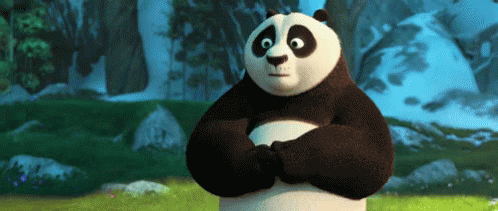

# Les chaînes de caractères

## Exercice 8

Ecrire un programme exo_8.c qui affiche le deuxième, le quatrième et le septième caractère d'une chaîne saisie au clavier (10 caractères maximum).

??? success "Solution"

    

## Exercice 9

Ecrire un programme exo_9.c qui :

1.  d'abord, crée une chaîne de caractères (20 caractères maximum),

2.  puis, y stocke la saisie de l'utilisateur lue caractère par caractère jusqu'à ce que la chaîne soit remplie,

3.  ensuite, affiche la chaîne,

4.  finalement, affiche la chaîne en ordre inverse.

??? success "Solution"

     

## Exercice 10

Ecrire un programme exo_10.c qui affiche le nombre de fois où le caractère 'a' est présent dans la chaîne "It's gonna be legend... wait for it... dary!".

??? success "Solution"

    
    

## Exercice 11

Reprendre l'exercice 11 dans un nouveau programme exo_10.c :

1. En rendant le **caractère** et la **chaîne** saisissables par l'utilisateur.

2. En recherchant minuscule et majuscule du caractère saisi pour les 26 lettres non accentuées.

??? success "Solution"

    