# Qt - Premier projet

## Création d’un projet

!!! warning ""

    Les captures ont été réalisées avec **différentes versions** de Qt Creator, des libellés peuvent différer de ce que vous voyez à l'écran.

1. Cliquer sur : **Fichier > Nouveau fichier ou projet**
    
    
    
2. Sélectionner **Application (Qt)** puis **Qt Widgets Application** et cliquer sur **Choisir…**
    
    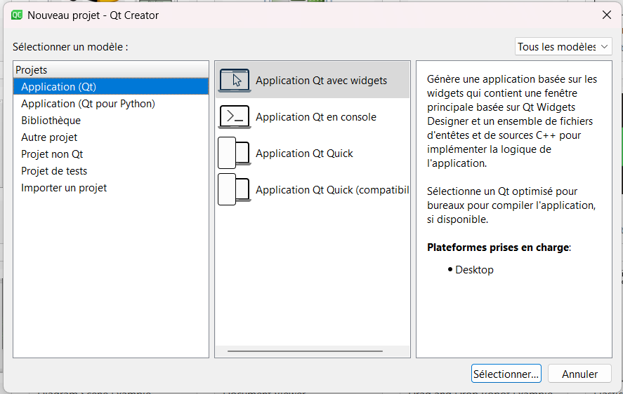
    
3. Sur la page **Emplacement/Location** donner un nom au projet et sélectionner le chemin du projet (au choix) les répertoires sont à créer s’ils n'existent pas. Cliquer sur **Suivant**.
    
    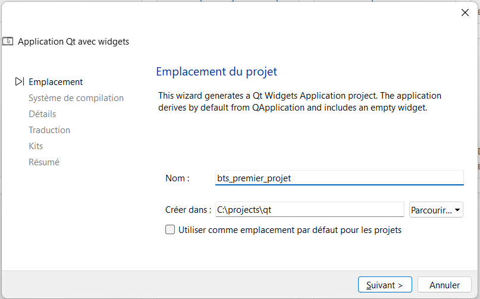
    
4. Sur la page **Système de compilation/Build System**, choisir le système **qmake**. Cliquer sur **Suivant**.

    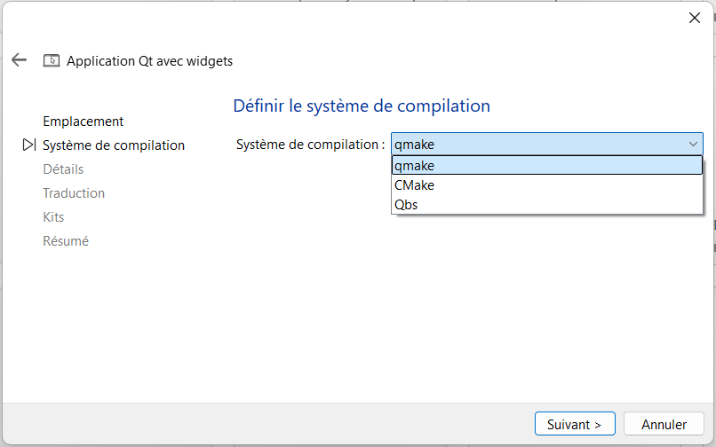
    
5. Sur la page **Détails/Details**, laisser le nom par défaut de la fenêtre principale `MainWindow`. Cliquer sur **Suivant**.

    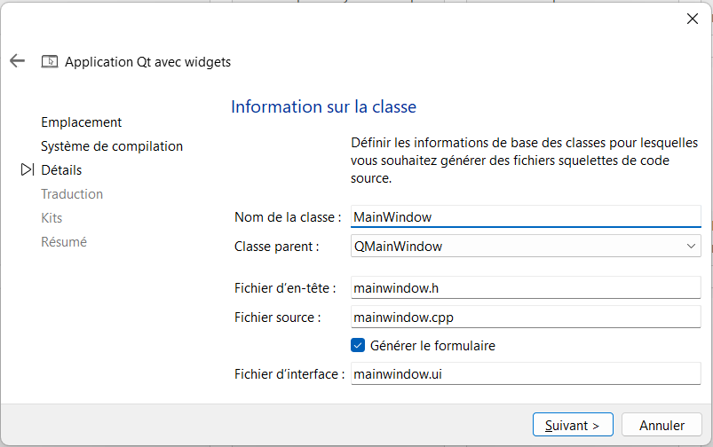
    
6. Sur la page **Traduction/Translation**, laisser les valeurs par défaut. Cliquer sur **Suivant**.

    
    
7. Sur la page **Kits/Kits**, sélectionner les cibles pour lesquelles vous souhaitez créer le programme. Cliquer sur **Suivant**.

    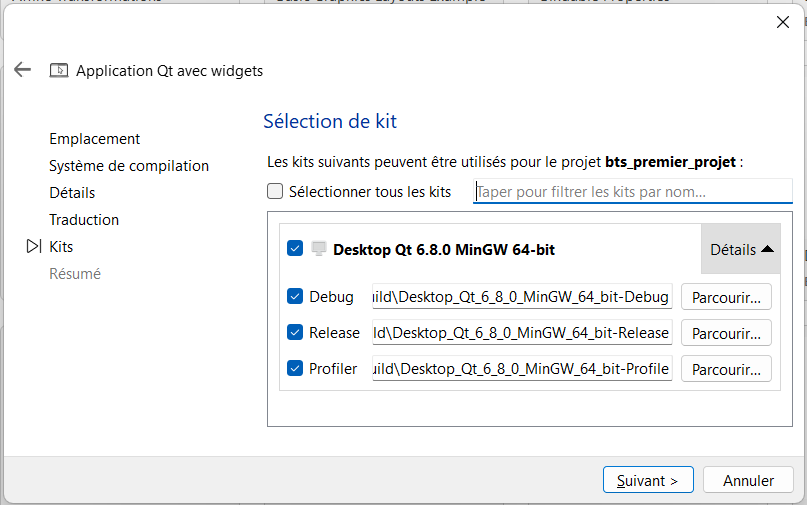
    
8. Sur la page **Résumé/Summary**, laisser les valeurs par défaut. Cliquer sur **Terminer**.

    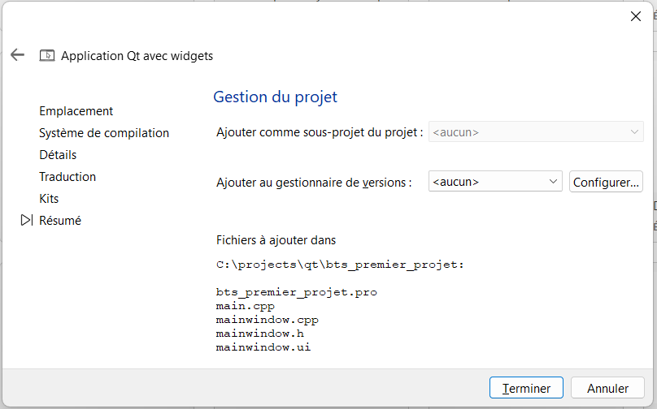

9. Appuyer sur la flèche verte en bas à gauche.
    
    
    
10. Le programme se lance, la fenêtre est vide.
    
    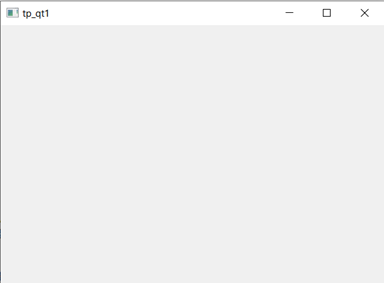

👍 Votre projet est prêt pour le développement !

## Les fichiers

<object class="fullScreenAble" data="../../pdf/cours/bts2/bts2_qt_02.pdf" type="application/pdf"></object>

A tout moment, utiliser la touche ++f1++ pour avoir de l’aide sur les classes des widgets et des classes Qt (la documentation est disponible sur [https://doc.qt.io/](https://doc.qt.io/)).

### `main.cpp`

```cpp
#include "mainwindow.h"

#include <QApplication>

int main(int argc, char *argv[])
{
    QApplication a(argc, argv); // (1)!
    MainWindow w; // (2)!
    w.show(); // (3)!
    return a.exec(); // (4)!
}
```

1.  Création de l'objet qui gère l'application.
2.  Création de l'objet qui gère la fenêtre principale.
3.  Affichage de la fenêtre principale.
4.  Lancement de la boucle d'événement.

On ne modifie que rarement ce fichier.

### `mainwindow.cpp`

C'est ici que la plupart de vos développements vont trouver place.

```cpp
#include "mainwindow.h"
#include "ui_mainwindow.h"

MainWindow::MainWindow(QWidget *parent) : QMainWindow(parent), ui(new Ui::MainWindow)
{
    ui->setupUi(this/* (4)!*/);

    // (1)!
}

MainWindow::~MainWindow()
{
    // (2)!

    delete ui;
}

// (3)!
```

1.  Placer ici tout le code à exécuter lors du chargement de la fenêtre... (création des widgets, connexions signaux/slots...)
2.  ... et ici lors de la fermeture (suppression des allocations dynamiques, fermeture de connexions aux bases de données...)
3.  Ici viendront les définitions des slots que vous créerez.
4.  `this` est un pointeur sur l'objet MainWindow.

`ui` est un attribut (donc disponible dans **toute** la classe) qui pointe sur les widgets ajoutés de la fenêtre :

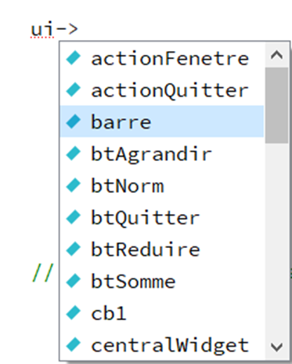

## Connexion signal &#8594; slot

<object class="fullScreenAble" data="../../pdf/cours/bts2/bts2_qt_03.pdf" type="application/pdf"></object>

1.  Dans la partie projet, double-cliquer sur le fichier `mainwindow.ui`.
    
    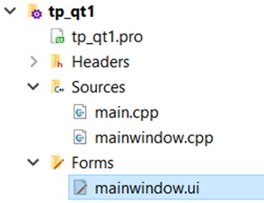
    
2.  Le designer apparaît :
    
    
    
3.  Pour ajouter un bouton sur la fenêtre, faire un glisser-déposer du widget de la liste des widgets vers l'aperçu de la fenêtre.
    
    
    
### 🧸 Connexion via le designer

Nous allons connecter le clic sur le bouton que nous venons de poser à la fermeture de la fenêtre.  

Le signal `QPushButton::clicked()` et le slot `QMainWindow::close()` sont deux éléments natifs du framework (que nous n'avons pas à développer).

1.  Passer en mode slots ( ++f4++ ).

    

2.  Cliquer sur le widget à l'origine du signal (le bouton) et, tout en maintenant le clic, déplacer le curseur vers la cible propriétaire du slot à déclencher (la fenêtre). 

    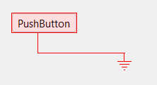

3.  La liste des signaux et slots s'affiche. 

    Cliquer sur la case à cocher **Afficher les signaux et slots hérités de QWidget**.
    
    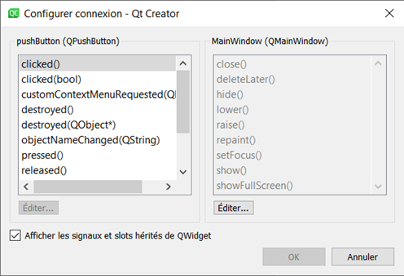
    
4.  Choisir le signal et le slot à connecter, ici, on choisit :

    + `clicked()` dans la liste de gauche,
    
    + `close()` dans la liste de droite.
    
    
    
5.  Valider et visualiser le résultat graphique.
    
    
    
6.  Résultat : un clic sur le bouton ferme la fenêtre.

    Tester en lançant l’application en appuyant sur la flèche verte en bas à gauche.
    
    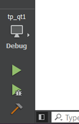

### 🎖️ Connexion via le code
    
On peut aussi associer un signal à un slot via le code.

C'est le mode opératoire **à privilégier** car il permet de centraliser les connexions dans le code et d'ainsi mieux les gérer.

<object class="fullScreenAble" data="../../pdf/cours/bts2/bts2_qt_04.pdf" type="application/pdf"></object>

Nous allons connecter le clic sur un nouveau bouton à l'agrandissement de la fenêtre : le signal `QPushButton::clicked()` et le slot `QMainWindow::showMaximized()`

1.  Ajouter un nouveau bouton via le designer

2.  Renommer l'objet en `bouton_2` en modifiant son `objectName` dans l'éditeur de propriété ou en double-cliquant dessus dans l'inspecteur d'objets.

    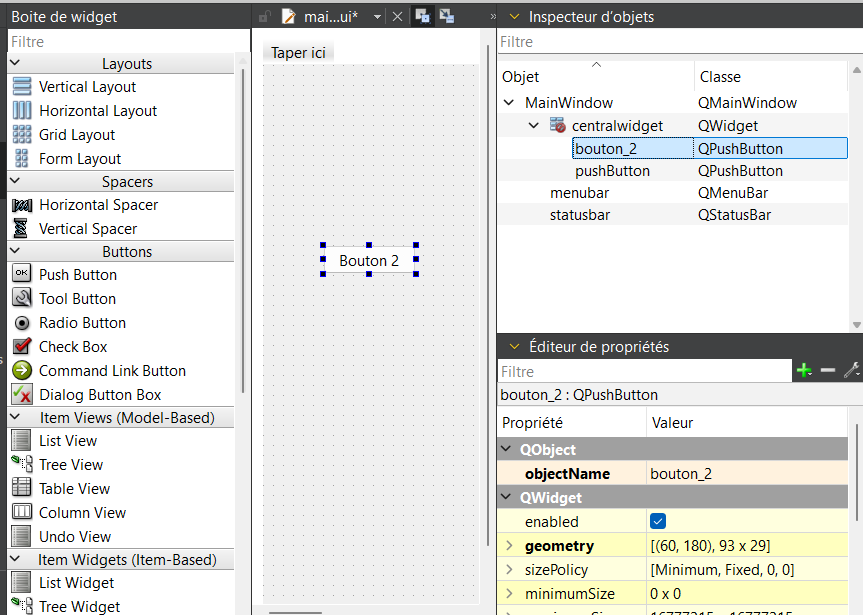

3.  Changer son libellé en `Bouton 2` en modifiant son `text` dans l'éditeur de propriété ou en double-cliquant dessus dans l'aperçu de la fenêtre.

    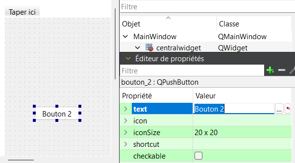

4.  Sauvegarder le fichier mainwindow.ui.

5.  Ouvrir le fichier mainwindow.cpp.

6.  Dans le constructeur, après l'instruction `ui->setupUi(this);`, ajouter la ligne suivante :

    ```cpp
    connect(
        ui->bouton_2/*(1)!*/, 
        SIGNAL(clicked(bool))/*(2)!*/, 
        this/*(3)!*/, 
        SLOT(showMaximized())/*(4)!*/
    );
    ```

    1.  Un pointeur vers l'objet qui envoie le signal : `ui->bouton_2`
    2.  Le prototype du signal en paramètre de la macro `SIGNAL()` : `SIGNAL(clicked(bool))`
    3.  Un pointeur vers l'objet qui contient le slot : `this` (la MainWindow)
    4.  Le prototype du slot en paramètre de la macro `SLOT()` : `SLOT(showMaximized())`

    ??? warning "`ui->bouton_2` n'est pas proposé par l'auto-complétion ?"

        Il peut arriver que les widgets tout juste ajoutés n'apparaissent pas en auto-complétion :

        

        Veillez à bien sauvegarder tous les fichiers puis lancer une compilation (build) en cliquant sur le bouton avec le marteau pour rafraîchir Qt Creator.

        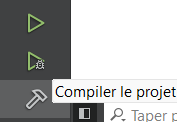

7. Sauvegarder et tester.

### ⚠️ Connexion via "Aller au slot"

Vous noterez peut-être qu'il est possible de déclarer un slot, le connecter à un signal et le définir en une seule action 🤩 via le clic-droit sur un widget puis **Aller au slot...**.

Elle est notée comme obsolète (deprecated) dans les dernières versions de Qt et ne sera donc bientôt **plus supportée** (un programme utilisant cette fonctionnalité devra être redéveloppé avant de le mettre à jour).

Vous pouvez donc utiliser cette fonctionnalité pour un prototypage rapide, mais c'est tout... 😭


    
## Déboguer

Pour mettre des traces dans votre programme vous pouvez utiliser `qDebug()`.

`qDebug()` est une fonction mais s’utilise comme cout.

Les messages soumis à `qDebug()` s'affichent dans le terminal visible dans l'onglet **Sortie de l'application**.
    
```cpp
#include <QDebug>

...

qDebug() << "Je suis passé par ici";
```

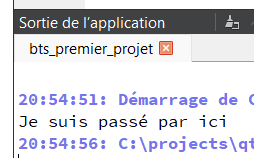
