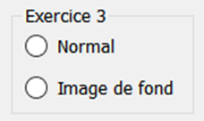
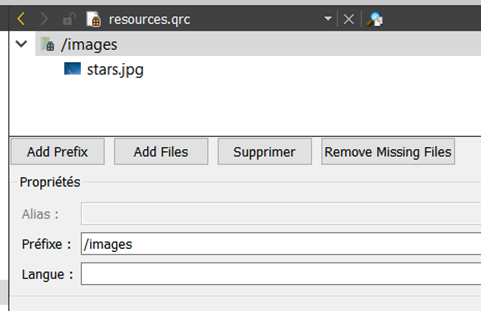

# Exercices

Au travers des exercices suivants, vous allez pouvoir manipuler les widgets et le mécanisme de signal/slot sur la base du cours, des éléments vus précédemment et de vos recherches dans la documentation.


Créer une application graphique QT Widgets dont le titre est **TP QT BTS2** et qui servira de projet pour l’**ensemble des exercices**.
    
## Exercice 1

!!! abstract "Objectifs"

    +   Créer des boutons
    
    +   Leur affecter des actions avec le designer et avec le code.

1. Ajouter 4 boutons à l’aide du designer :
    
    
    
2. Utiliser l'association des signaux et slots ( ++f4++ ) pour réaliser ces 3 actions :

    - Bouton **Agrandir** affiche la fenêtre en taille maximale.

    - Bouton **Normal** affiche la fenêtre dans sa taille d'origine

    - Bouton **Quitter** ferme l'application

3. Utiliser la **connexion par le code** pour réaliser l'action suivante :

    - Bouton **Réduire** réduit la fenêtre dans la barre des tâches (MainWindow).

## Exercice 2

!!! abstract "Objectifs"

    +   Modifier un widget créé via le designer par le code

    +   Faire communiquer deux widgets en utilisant le designer.

1. Ajouter un widget ComboBox et un widget LineEdit via le designer :
    
    
    
2. Remplir la ComboBox avec la méthode `addItem()` de la classe `QComboBox` depuis le constructeur de la `MainWindow` (en utilisant `ui`).

3. Utiliser l'association des signaux et slots (F4) pour remplacer le texte du LineEdit par le texte de l’item sélectionné dans la ComboBox.

## Création de signals et de slots

<object class="fullScreenAble" data="../../pdf/cours/bts2/bts2_qt_05.pdf" type="application/pdf"></object>

## Exercice 3

!!! abstract "Objectifs"

    Créer un slot et le connecter à des widgets.

1. Ajouter un GroupBox et y ajouter deux RadioButton.
    
    
    
    Suivant la sélection, une image sera affichée ou non au fond de la fenêtre.
    
2. Ajouter un slot `changeBackground()` dans la classe `MainWindow` pour traiter la sélection des `QRadioButton`. La définition de la méthode sera traitée plus loin dans l’exercice.

3. Par programmation, dans le constructeur de la `MainWindow`, connecter (avec la primitive `connect`) le signal `clicked()` des deux `QRadioButton` au slot `changeBackground()`.

4. Ajouter une image en tant que ressource du projet :

    1. Dans l’arborescence, cliquer-droit sur le nom du projet et choisir **Add new…**

    2. Dans la fenêtre, choisir **Qt > Qt Resource File** et cliquer sur **Choose…**
        
        
        
    3. Nommer le fichier **resources.qrc** et valider les étapes suivantes

    4. Double-cliquer sur le nouveau fichier

    5. Cliquer sur **Add Prefix**

    6. Modifier la valeur du **Préfixe** pour **/images**

    7. Copier-coller une image (800x600) au choix dans le dossier du projet via l’explorateur Windows

    8. Cliquer sur **Add Files**

    9. Sélectionner l’image et valider
        
        
        
    10. Sauvegarder le fichier **resources.qrc**

5. En fonction du `QRadioButton` coché (`checked`), utiliser la méthode `setStyleSheet()` de la classe `MainWindow` pour changer l’image de fond du widget central avec une des valeurs suivantes :
    
    ```cpp
    // Utiliser une image pour le fond d'écran
    "#centralwidget { background-image: url(:/images/{nom_de_l_image.jpg); }"
    
    // Masquer l'image en fond d'écran
    "#centralwidget { background-image: none; }"
    ```
    
## Exercice 4

!!! abstract "Objectifs"

    Récupérer une valeur de l’IHM depuis un slot créé.

On veut pouvoir modifier le titre de la fenêtre après avoir saisi une valeur dans un widget LineEdit et appuyé sur Entrée.

Peut-on le faire directement depuis le designer ? Pourquoi ?

1. Ajouter un widget **LineEdit**.
    
    
    
2. Créer un slot `changeWindowTitle**()**` dans la classe `MainWindow`.

3. Récupérer la valeur du widget `QLineEdit` et la passer à la méthode `setWindowTitle()` de la classe `MainWindow`.

4. Avec le designer, réaliser la connexion nécessaire pour répondre au besoin. 

Si le slot créé n’apparaît pas dans la liste, il faut l’ajouter en utilisant le bouton **Editer…** de la fenêtre **Configurer connexion**.
    


## Repartir du bon pied

Projet avec les 4 premiers exercices : 📂[TP_QT_BTS2](../files/bts2/TP_QT_BTS2.zip)

## Exercice 5

!!! abstract "Objectifs"

    +   Passer des valeurs d’un widget à un autre
    +   Créer et émettre un signal

On souhaite réaliser une calculatrice "simple" :


+ Elle est composée de deux **sliders** qui pilotent l’affichage de deux **LCDNumber**.

+ Le **+** central est affiché à l’aide d’un label.

+ L’affichage sombre des **LCDNumber** est réalisé en passant la propriété **segmentStyle** à **Flat**.

**Réaliser cette première partie** de l’exercice avec le designer.


Au clic sur le bouton **=**, la somme des deux valeurs de **sliders** doit s’afficher dans un troisième **LCDNumber**. Toutefois, le signal clicked() de la classe QPushButton n’a pas de paramètre de type entier et  permet encore moins d’envoyer deux valeurs qui ne lui appartiennent pas.


Le clic sur le `QPushButton` va devoir déclencher un slot (à créer) dans la classe `MainWindow` qui va lui-même émettre un signal au bon format (à créer) qui sera connecter au slot `display(int)` du troisième `QLCDNumber`.

**Réaliser cette seconde partie** pour terminer la « calculatrice ».

## Exercice 6

!!! abstract "Objectifs"

    +   Utiliser les slots de manipulation de texte.
    +   Personnaliser un widget avec une image

1. Ajouter sur la fenêtre un widget Textedit et deux boutons Copier et Coller pour copier ou coller du texte dans notre boite de texte.
    
    Les icones sont modifiables dans la fenêtre des propriétés via l’attribut « Marche normale » de l’attribut icon des `QAbstractButton`. On peut trouver de nombreuses icones libres de droits sur Internet, par exemple sur le site [iconmonstr.com](https://iconmonstr.com/).
    
2. Ajouter une icône aux deux boutons en important au préalable deux icones dans le fichier resources.qrc.
    
    
    
3. Utiliser l'association des signaux et slots ( ++f4++ ) pour finir l’exercice.

## Exercice 7

!!! abstract "Objectifs"

    Comprendre le fonctionnement des progressBar.

1. Ajouter un widget Progress bar et un bouton Lancer.
    
    
    
    Il va falloir dans le slot du bouton faire une boucle allant de 0 à 100 et qui sera temporisée à chaque tour pendant 100ms. Pour temporiser le programme, on utilisera la méthode `msleep(int)` de la classe `QThread` qui suspend le thread.
    
2. Lancer la progression de la barre en prenant comme unité le centième de seconde.