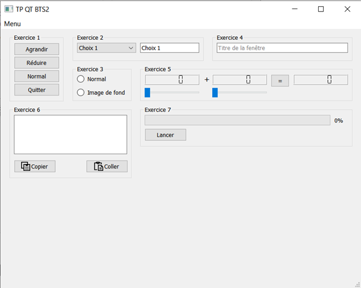

# Exercices

Au travers des exercices suivants, vous allez pouvoir manipuler les widgets et le mécanisme de signal/slot sur la base du cours, des éléments ci-dessus et de vos recherches dans la documentation.



Créer une application graphique QT Widgets dont le titre est **TP QT BTS2** et qui servira de projet pour l’ensemble des exercices.
    
## Exercice 1
    
L’objectif de cet exercice est de créer des boutons et de leur affecter des actions avec le designer et avec le code.

1. Ajouter 4 boutons à l’aide du designer :
    
    
    
2. Utiliser l'association des signaux et slots (**F4**) pour réaliser ces 3 actions :
    - Bouton **Réduire** réduit la fenêtre dans la barre des tâches
    - Bouton **Normal** affiche la fenêtre dans sa taille d'origine
    - Bouton **Quitter** ferme l'application
3. Utiliser l'option clic droit > **Aller aux slots** pour que :
    - Bouton **Agrandir** affiche la fenêtre en taille maximale avec la méthode `showMaximized()` de la classe `MainWindow`.

## Exercice 2

Les objectifs de cet exercice sont :

- Modifier un widget créé via le designer par le code
- Faire communiquer deux widgets en utilisant le designer.
1. Ajouter un widget ComboBox et un widget LineEdit via le designer :
    
    
    
2. Remplir la ComboBox avec la méthode addItem() de la classe QComboBox depuis le constructeur de la MainWindow (en utilisant ui).
3. Utiliser l'association des signaux et slots (F4) pour remplacer le texte du LineEdit par le texte de l’item sélectionné dans la ComboBox.

## Exercice 3

L’objectif de cet exercice est de créer un slot et de le connecter à des widgets.

1. Ajouter un GroupBox et y ajouter deux RadioButton.
    
    
    
    Suivant la sélection, une image sera affichée ou non au fond de la fenêtre.
    
2. Ajouter un slot `changeBackground()` dans la classe `MainWindow` pour traiter la sélection des `QRadioButton`. La définition de la méthode sera traitée plus loin dans l’exercice.
3. Par programmation, dans le constructeur de la `MainWindow`, connecter (avec la primitive `connect`) le signal `clicked**()**` des deux `QRadioButton` au slot `changeBackground()`.
4. Ajouter une image en tant que ressource du projet :
    1. Dans l’arborescence, cliquer-droit sur le nom du projet et choisir **Add new…**
    2. Dans la fenêtre, choisir **Qt > Qt Resource File** et cliquer sur **Choose…**
        
        
        
    3. Nommer le fichier **resources.qrc** et valider les étapes suivantes
    4. Double-cliquer sur le nouveau fichier
    5. Cliquer sur **Add Prefix**
    6. Modifier la valeur du **Préfixe** pour **/images**
    7. Copier-coller une image (800x600) au choix dans le dossier du projet via l’explorateur Windows
    8. Cliquer sur **Add Files**
    9. Sélectionner l’image et valider
        
        
        
    10. Sauvegarder le fichier **resources.qrc**
5. En fonction du `QRadioButton` coché (`checked`), utiliser la méthode `setStyleSheet()` de la classe `MainWindow` pour changer l’image de fond du widget central avec une des valeurs suivantes :
    
    ```cpp
    // Utiliser une image pour le fond d'écran
    "#centralwidget { background-image: url(:/images/{nom_de_l_image.jpg); }"
    
    // Masquer l'image en fond d'écran
    "#centralwidget { background-image: none; }"
    ```
    
    ## Exercice 4
    
    L’objectif de cet exercice est de récupérer une valeur de l’IHM depuis un slot créé.
    
    On veut pouvoir modifier le titre de la fenêtre après avoir saisi une valeur dans un widget LineEdit et appuyé sur Entrée.
    
    Peut-on le faire directement depuis le designer ? Pourquoi ?
    
    1. Ajouter un widget **LineEdit**.
        
        
        
    2. Créer un slot `changeWindowTitle**()**` dans la classe `MainWindow`.
    3. Récupérer la valeur du widget `QLineEdit` et la passer à la méthode `setWindowTitle()` de la classe `MainWindow`.
    4. Avec le designer, réaliser la connexion nécessaire pour répondre au besoin. 
    Si le slot créé n’apparaît pas dans la liste, il faut l’ajouter en utilisant le bouton **Editer…** de la fenêtre **Configurer connexion**.
        
        