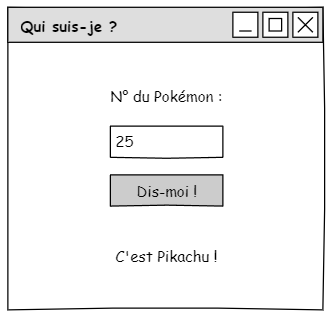

# Projet Pokédex 2.0


Ce TP propose de réaliser un Pokédex en utilisant le framework Qt. 

Un Pokédex est un appareil qui accompagne tout bon dresseur de Pokémon(1) et qui liste les Pokémon et leurs informations.
{ .annotate }

1.  :material-pokeball: Pokémon est invariable et s'écrit avec un accent même en anglais.

Notre application émulera cet appareil et s’appuiera sur les webservices du site internet [pokeapi.co](https://pokeapi.co/) pour récupérer informations sur les Pokémon et leurs images.

## Travaux préparatoires

PokéAPI propose des webservices [REST]("REpresentational State Transfer") permettant de récupérer des informations sur les Pokémon.

Pour les utiliser, nous devons maîtriser deux techniques avec Qt :

+   [ ] Envoyer une requête HTTP GET et gérer la réponse

+   [ ] Manipuler des informations au format [JSON]("JavaScript Object Notation")

### Envoyer une requête HTTP GET et gérer la réponse

1.  Ajouter le module Network au projet Qt en ajoutant la ligne suivante au début du fichier `.pro` :

    ```cpp
    QT += network
    ```

2.  Pour gérer les requêtes HTTP, on utilisera un objet **unique** `QNetworkAccessManager` ajouté en attribut de la fenêtre.

    Cet objet contient une [méthode](https://doc.qt.io/qt-5/qnetworkaccessmanager.html#get) `QNetworkReply * get(QNetworkRequest(QUrl("url à requêter")))` qui permet d’envoyer une requête HTTP de type GET.

    On sauvera l'adresse de l'objet `QNetworkReply` renvoyée par la méthode dans un attribut `QNetworkReply *` de la fenêtre.

    Ajouter les attributs suivants à la classe `MainWindow` :

    ```cpp
    QNetworkAccessManager * qnam;
    QNetworkReply * qnr;
    ```

    Dans le constructeur de la `MainWindow`, affecter un nouvel objet `QNetworkAccessManager` à `qnam` et `nullptr` à `qnr` (l'objet `qnr` sera renouvelé à chaque nouvelle requête).

    Détruire `qnam` et `qnr` lorsque le programme s'arrête.

3.  Ajouter un bouton dans la fenêtre qui permettra de déclencher l'envoi de la requête.

4.  Connecter le clic du bouton à un nouveau slot `launchHTTPRequest`.

    Dans la définition du slot `launchHTTPRequest` appeler la méthode `get()` de `qnam` sur l'url `https://pokeapi.co/api/v2/pokemon/25` et stocker le résultat dans `qnr`.
    
5.  La requête HTTP est lancée de manière asynchrone(1). 
    { .annotate }

    1.  :material-pokeball: La requête est lancée en arrière-plan, dans un autre thread, elle ne bloque pas l'exécution du thread courant et donc l'application.

    Quand la réponse du serveur (quelle qu'elle soit) est complétement reçue, l'objet `QNetworkReply` émet un signal `finished()`.

    Connecter un nouveau slot `manageHTTPAnswer` à ce signal juste après l'appel de la méthode `get()` de `qnam`.

    En effet, un nouvel objet `QNetworkReply` est créé à chaque appel de `get`, `qnr` change donc d'adresse et il faut donc créer une nouvelle connexion.

6.  Dans la définition du slot `manageHTTPAnswer`, afficher dans la console le contenu du corps de la réponse en appelant la méthode `readAll()` de `qnr`.

7.  Tester.

    Si tout se passe bien, la console doit être remplie 

    ```json
    {"abilities":[{"ability":{"name":"static","url":"https://pokeapi.co/api/v2/ability/9/"},"is_hidden":false,"slot":1},{"ability":{"name":"lightning-rod","url":"https://pokeapi.co/api/v2/ability/31/"},"is_hidden":true,"slot":3}],"base_experience":112,"cries":{"latest":"https://raw.githubusercontent.com/PokeAPI/cries/main/cries/pokemon/latest/25.ogg","legacy":"https://raw.githubusercontent.com/PokeAPI/cries/main/cries/pokemon/legacy/25.ogg"},...
    ```

Améliorer le script :

+   [ ] Déconnecter l'objet pointé par `qnr` de `manageHTTPAnswer` et le supprimer avant l'appel de la méthode `get()`.

+   [ ] Gérer les erreurs HTTP en connectant le signal QNetworkReply::errorOccurred à un nouveau slot `manageHTTPErrors`.

### Manipuler des informations au format JSON

1.  Ajouter un bouton dans la fenêtre qui permettra de déclencher la lecture du JSON.

2.  Connecter le clic du bouton à un nouveau slot `readJSON`.

    Dans la définition du slot `readJSON`, nous allons créer un objet `QJsonObject` à partir du contenu JSON suivant :

    ```json
    {
        "FirstName": "John",
        "LastName": "Doe",
        "Age": 43,
        "Address": {
            "Street": "Downing Street 10",
            "City": "London",
            "Country": "Great Britain"
        },
        "Phone numbers": [
            "+44 1234567",
            "+44 2345678"
        ]
    }
    ```

    Le code permettant de réaliser cela est le suivant :

    ```cpp
    QByteArray data("Données au format JSON");
    QJsonDocument doc = QJsonDocument::fromJson(data);
    QJsonObject json = doc.object();
    ```

    Utiliser Notepad++ pour : 
        
    +   mettre les données JSON sur une ligne, 
    
    +   supprimer les doubles espaces,
    
    +   échapper les guillemets doubles.
    
    Intégrer le résultat au code ci-dessus dans le slot `readJSON`.

3.  Pour accéder à une valeur, la méthode la plus **sûre** est de réaliser la petite gymnastique suivante :

    1. vérifier que le champ/attribut existe,

    2. vérifier qu'il est bien du type attendu (int, string, array, object...),

    3. récupérer sa valeur.

    Et répéter cela pour chaque niveau "hiérarchique"... 😥

    Afficher le prénom à l'aide du code suivant :

    ```cpp
    if (json.contains("FirstName") && json["FirstName"].isString()) {
        qDebug() << json["FirstName"].toString();
    }
    ```

4. Tester.

5. Afficher dans la console "John Doe (43), London" à l'aide des informations extraites des données JSON.

Améliorer le script :

+   [ ] Créer une classe dérivée de QJsonObject et surdéfinir la méthode `value()` pour qu'elle lève une exception en cas d'erreur (et s'éviter la petite gymnastique 😅).

### Combiner les deux techniques

En combinant les deux techniques, créer une mini-application qui nous affiche le nom en français d'un Pokémon dont on lui soumet le numéro.

